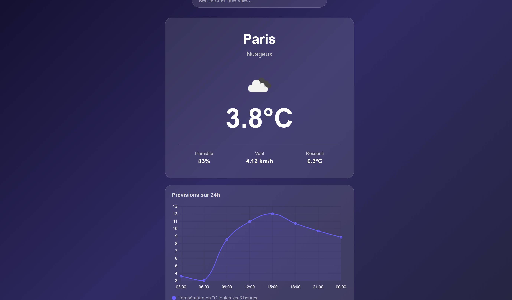

# WeatherDash

Application météo interactive construite avec Angular 19 et l'API OpenWeatherMap. Elle affiche la météo en temps réel d'une ville et les prévisions de température sur 24h sous forme de graphique.

---

## Pourquoi ce projet ?

Ce projet a été réalisé en dehors du cadre scolaire pour progresser sur des technologies que je n'avais pas encore pratiquées : Angular, TypeScript, et la visualisation de données. Il fait suite à CinéSearch (React) et m'a permis de comparer deux approches différentes du développement frontend.

---

## Fonctionnalités

- Météo en temps réel par ville (température, humidité, vent, ressenti)
- Icône météo dynamique selon les conditions et l'heure
- Graphique des températures sur les 24 prochaines heures
- Recherche de n'importe quelle ville du monde
- Interface responsive

---

## Technologies utilisées

- **Angular 19** — framework frontend
- **TypeScript** — langage principal
- **Chart.js** — bibliothèque de graphiques
- **HttpClient** — requêtes HTTP natives Angular
- **OpenWeatherMap API** — données météo en temps réel

---

## Compétences travaillées

- Architecture Angular : composants, services, injection de dépendances
- TypeScript : typage, interfaces, classes
- Consommation d'une API REST avec authentification par clé
- Visualisation de données avec Chart.js
- Gestion de données imbriquées en JSON
- Communication entre composants parent/enfant avec `input()`

---

## Installation et déploiement local

### Prérequis

- Node.js installé sur ta machine
- Un compte OpenWeatherMap (gratuit)

### Étapes

**1. Clone le projet**
```bash
git clone https://github.com/TON_USERNAME/weather-dash.git
cd weather-dash
```

**2. Installe les dépendances**
```bash
npm install
```

**3. Crée le fichier d'environnement**

Crée un dossier `src/environments/` et dedans un fichier `environment.ts` :
```typescript
export const environment = {
  production: false,
  apiKey: 'TA_CLE_OPENWEATHERMAP'
}
```

Pour obtenir une clé API gratuite : [openweathermap.org/api](https://openweathermap.org/api)

**4. Lance le projet**
```bash
ng serve
```

L'application est accessible sur `http://localhost:4200`

---

## Aperçu

